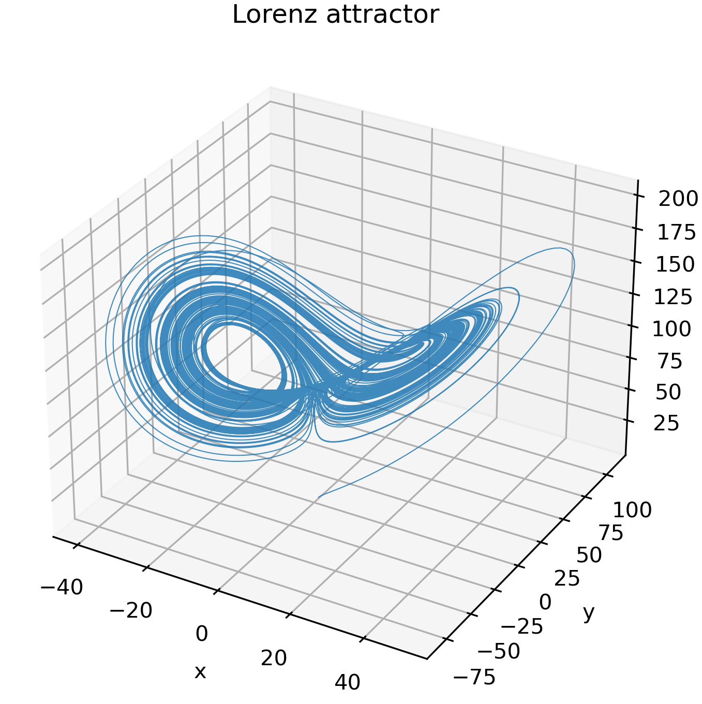

# ローレンツ方程式のもつカオス
気象における対流の研究に端を発したカオスを伴う非線形常微分方程式。
これが特定パラメータでカオスを持つことを確認する。そのためにルンゲクッタを用いて求積し解の軌跡を調べる。

# lorenz_solver.py
このファイルがローレンツ方程式を解くコード。
方程式系は

$$
\begin{array}{}
\frac{dx}{dt} &=& \sigma (y-x) \\\
\frac{dy}{dt} &=& \rho x - x z - y \\\
\frac{dz}{dt} &=& x y - \beta z
\end{array}
$$

その結果が lorenz_data.txt に出力される。

# plot_lorenz.py
このファイルでその結果を三次元プロットする。
例えば$$\rho = 110$$にすると、以下のような図が得られる。

